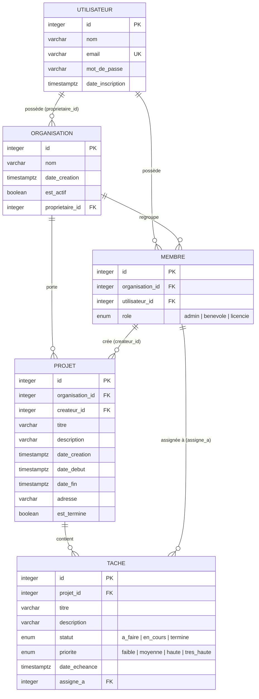

```mermaid
erDiagram
    UTILISATEUR ||--o{ MEMBRE : "possède"
    UTILISATEUR ||--o{ ORGANISATION : "possède (proprietaire_id)"
    ORGANISATION ||--o{ MEMBRE : "regroupe"
    ORGANISATION ||--o{ PROJET : "porte"
    MEMBRE ||--o{ PROJET : "crée (createur_id)"
    PROJET ||--o{ TACHE : "contient"
    MEMBRE ||--o{ TACHE : "assignée à (assigne_a)"

    UTILISATEUR {
        integer id PK
        varchar nom
        varchar email UK
        varchar mot_de_passe
        timestamptz date_inscription
    }
    ORGANISATION {
        integer id PK
        varchar nom
        timestamptz date_creation
        boolean est_actif
        integer proprietaire_id FK
    }
    MEMBRE {
        integer id PK
        integer organisation_id FK
        integer utilisateur_id FK
        enum role "admin | benevole | licencie"
    }
    PROJET {
        integer id PK
        integer organisation_id FK
        integer createur_id FK
        varchar titre
        varchar description
        timestamptz date_creation
        timestamptz date_debut
        timestamptz date_fin
        varchar adresse
        boolean est_termine
    }
    TACHE {
        integer id PK
        integer projet_id FK
        varchar titre
        varchar description
        enum statut "a_faire | en_cours | termine"
        enum priorite "faible | moyenne | haute | tres_haute"
        timestamptz date_echeance
        integer assigne_a FK
    }
```
